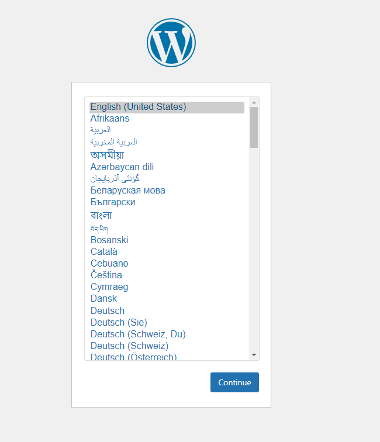

1.In order to monitor the website , "miniOrange" is suggested to help you.
  This plugin include lots of functions, like ip blcoking ,Malware scanning , encrypted Backup etc.
 

2.First login to wordpress and search miniOrange in plugin

3.
  
