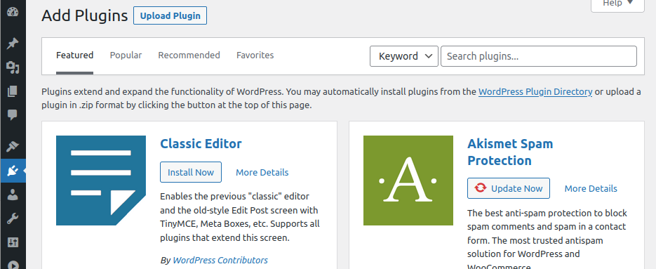
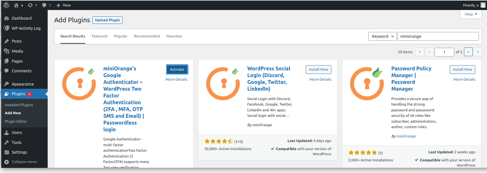
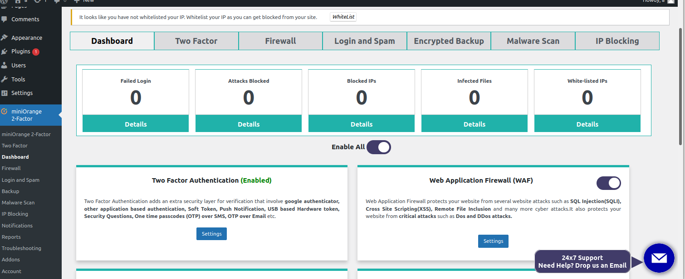

4.Search the plugin that you want to use. In this tutorial , 1st is chosen.

5.Activate the plugin and start to enable the functions.

You can see that their are dashboards related to faile login ,attacks blocked etc. This can provide information for you determine wheter it is attack or normal login.

 
