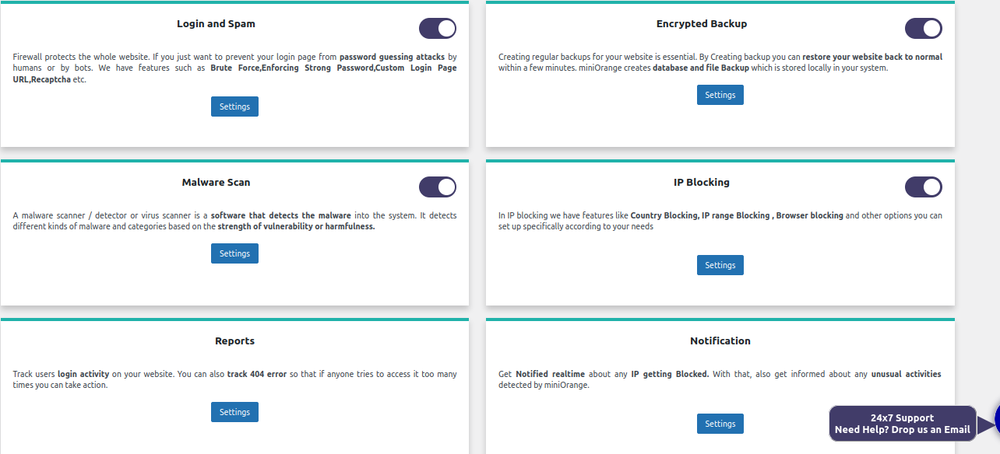
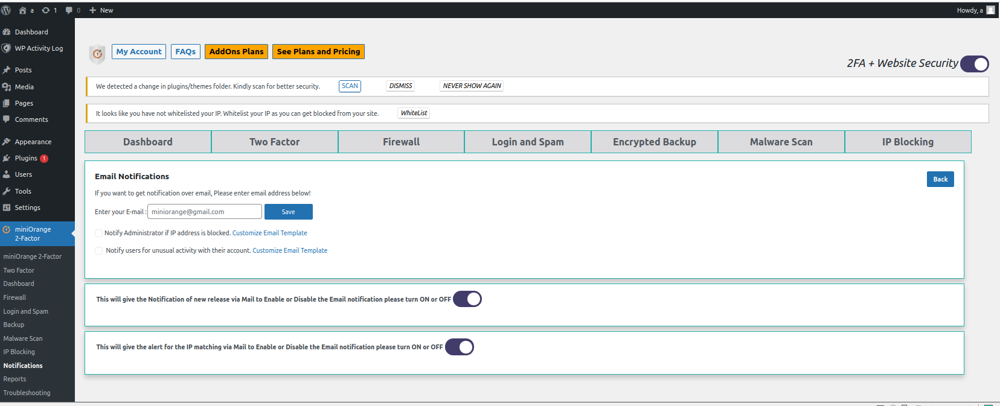

1.You can enable different function .

2.You can get notified immediately by email if any unusual activities detected by miniOrange.

Quick test
>>Q1: What should we do if we receive report? <<
[ ] Ignore it
[*] Reporting to the management.
[*] Investigating the unusual activities.

