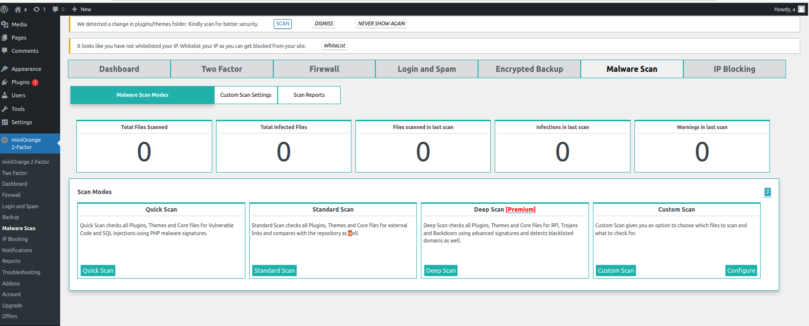
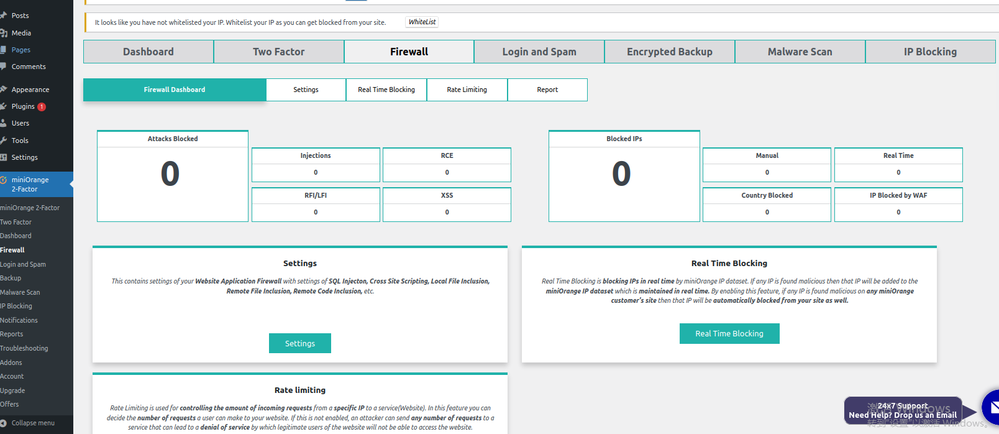

Insider attack include two types , one is malicious and other is accidental.
We can detect the attack by checking all Plugins, Themes and Core files for RFI, Trojans and Backdoors using advanced signatures and detects blacklisted domains as well.By using the miniorange, we can detect the insider attack.

External attack can detect by antivirus software or firewall.

